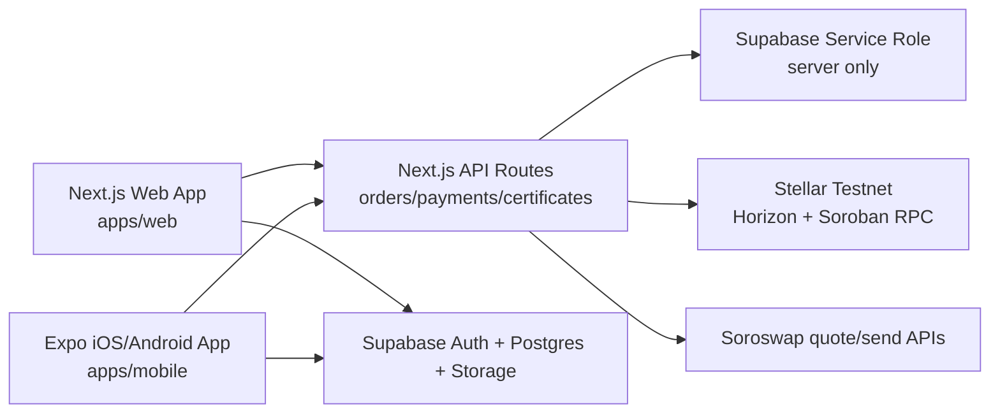

# ArtisanS Vercel + Supabase + Expo Deployment

This is the production path for one shared ArtisanS system:

- **Website:** Next.js on Vercel from `apps/web`
- **Mobile:** Expo EAS builds from `apps/mobile`
- **Database/Auth/Storage:** one Supabase project
- **Blockchain:** Stellar Testnet first, with USDC payment intent and certificate verification APIs

## Architecture Flow



The browser and mobile app use the Supabase anon key only. Server-only actions such as private file authorization, payment verification, certificate issuing, and admin moderation stay behind Next.js API routes.

## 1. Supabase

Create one Supabase project for ArtisanS. Use a staging project before production.

Apply migrations in order:

```powershell
supabase link --project-ref YOUR_PROJECT_REF
supabase db push
```

If the Supabase CLI is not installed, open the Supabase SQL editor and run the files in this order:

```txt
supabase/migrations/202605260001_artisans_core.sql
supabase/migrations/202605260002_storage_buckets.sql
supabase/migrations/202605290001_public_profile_privacy.sql
```

Optional demo data:

```txt
supabase/seed.sql
```

Required Supabase checks:

- RLS is enabled on every app table.
- Public clients can read only published marketplace/certificate data.
- Buyers and artists can only read or update their own private records.
- `SUPABASE_SERVICE_ROLE_KEY` is never exposed to mobile or browser code.
- Storage bucket privacy matches `docs/production-checklist.md`.

Auth configuration:

- Enable email auth for MVP.
- Add Google OAuth later for Gmail ownership verification.
- Add web redirect URLs for local, preview, and production Vercel domains.
- Add mobile deep link redirect scheme: `artisans://`.

## 2. Vercel Web Deployment

Import the GitHub repo into Vercel.

Recommended project settings:

```txt
Framework Preset: Next.js
Root Directory: apps/web
Install Command: configured in apps/web/vercel.json
Build Command: configured in apps/web/vercel.json
```

Set these Vercel environment variables:

```txt
NEXT_PUBLIC_SUPABASE_URL=
NEXT_PUBLIC_SUPABASE_ANON_KEY=
SUPABASE_SERVICE_ROLE_KEY=
NEXT_PUBLIC_STELLAR_NETWORK=testnet
NEXT_PUBLIC_STELLAR_HORIZON_URL=https://horizon-testnet.stellar.org
NEXT_PUBLIC_STELLAR_RPC_URL=https://soroban-testnet.stellar.org
STELLAR_USDC_ASSET_CODE=USDC
STELLAR_USDC_ISSUER=
ARTISANS_TREASURY_WALLET=
ARTISANS_PLATFORM_FEE_BPS=500
SOROSWAP_API_KEY=
SENTRY_DSN=
```

Do not prefix private server secrets with `NEXT_PUBLIC_`.

Local production check:

```powershell
npm.cmd run deploy:web:build
```

After Vercel deploys, use the deployed URL as the mobile API base:

```txt
EXPO_PUBLIC_API_BASE_URL=https://your-artisans-domain.vercel.app
```

## 3. Expo EAS Mobile Deployment

From the mobile workspace:

```powershell
cd apps/mobile
npx eas-cli@latest login
npx eas-cli@latest init
```

Keep `apps/mobile/eas.json` committed. EAS may add a project ID to the Expo config during initialization; commit that generated config change after checking it does not include secrets.

Set these EAS environment variables through the EAS dashboard or EAS CLI environment management:

```txt
EXPO_PUBLIC_API_BASE_URL=https://your-artisans-domain.vercel.app
EXPO_PUBLIC_SUPABASE_URL=
EXPO_PUBLIC_SUPABASE_ANON_KEY=
EXPO_PUBLIC_STELLAR_NETWORK=testnet
EXPO_PUBLIC_STELLAR_HORIZON_URL=https://horizon-testnet.stellar.org
EXPO_PUBLIC_STELLAR_RPC_URL=https://soroban-testnet.stellar.org
```

Only public config belongs in `EXPO_PUBLIC_*`. Do not put `SUPABASE_SERVICE_ROLE_KEY`, private Stellar keys, Apple credentials, Google service account JSON, or admin secrets in Expo public env vars.

Preview builds:

```powershell
npm.cmd run deploy:mobile:android
npm.cmd run deploy:mobile:ios
```

Production builds:

```powershell
npm.cmd run deploy:mobile:production
```

Store submission still requires:

- Apple Developer Program membership for App Store/TestFlight.
- Google Play Developer account for Play Store/internal tracks.
- App signing credentials configured in EAS.

## 4. One Database, One Product Flow

Use Supabase as the shared source of truth:

- User profile setup writes to `profiles`.
- Artist data writes to `artist_profiles`.
- Marketplace data reads from `artworks` and `listings`.
- Orders, shipping quotes, messages, and payments use their matching order tables.
- Mobile calls the same deployed Next.js API routes for Stellar payment build/confirm and certificate verification.

This keeps web and mobile in the same flow while keeping sensitive payment and certificate checks on the server.

## 5. Release Gate

Before production:

```powershell
npm.cmd run typecheck
npm.cmd test
npm.cmd run build
```

Manual QA:

- Create profile on web and confirm mobile reads the same Supabase profile.
- Create artist listing and confirm marketplace visibility.
- Add to cart and confirm buyer dashboard state.
- Build Stellar payment intent and verify wrong transaction hashes are rejected.
- Confirm digital originals are not public.
- Confirm headers and RLS policies are active.
- Run Android emulator QA against the preview build before Play Store internal release.

